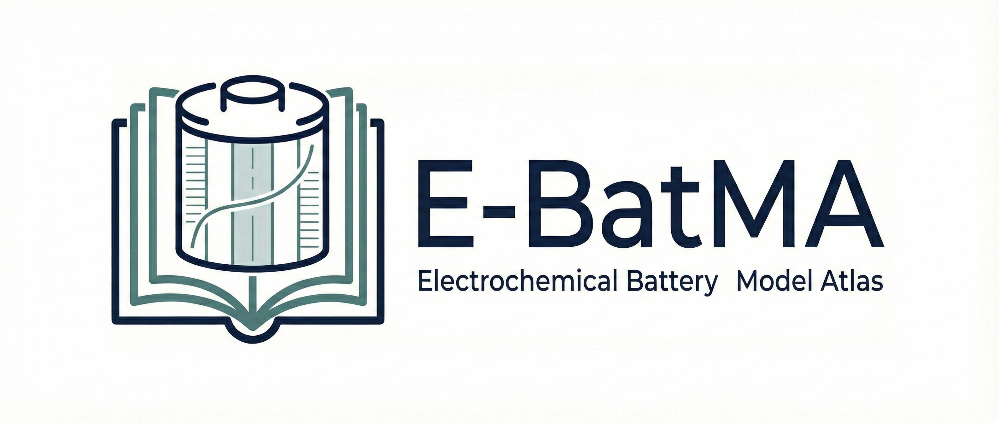

  

  # Electrochemical Battery Model Zoo

A curated index of open-source **electrochemical battery models**, with emphasis on the **Doyle–Fuller–Newman / pseudo-two-dimensional (DFN/P2D) family** and its reduced/extended variants: **Single Particle Model (SPM)**, **Single Particle Model with electrolyte (SPMe)**, thermal coupling, and degradation.

This repo is structured so a beginner can pick a model, run a first example, and know where to start reading code.

If acronym-heavy pages feel dense, start with [`GLOSSARY.md`](GLOSSARY.md).

## Goals
- Turn scattered repositories into a **searchable index**
- Provide **structured, comparable reviews** (assumptions, reproducibility, extensibility, intended use)
- Offer an **onboarding path** for beginners (concept map → first run → deeper dives)
- Make it easy for the community to contribute via PRs

## Quick links (start here)
- First run checklist: [`FIRST_RUN.md`](FIRST_RUN.md)
- Learning path: [`LEARNING_PATH.md`](LEARNING_PATH.md)
- Model map (SPM → SPMe → DFN): [`MODEL_MAP.md`](MODEL_MAP.md)
- Glossary (minimal): [`GLOSSARY.md`](GLOSSARY.md)
- Model pages: [`MODELS/`](MODELS/)
- Machine-readable index: [`data/models.yaml`](data/models.yaml)
- Review rubric: [`rubric.md`](rubric.md)
- References: [`REFERENCES.md`](REFERENCES.md) + [`references.bib`](references.bib)

---

## Quickstart
If you just arrived, do this in order:
1. Read [`FIRST_RUN.md`](FIRST_RUN.md)
2. Pick one model from **Choose a model** below
3. Run one standard test: **1C constant-current (CC) discharge** at **25°C**
4. Record at least voltage vs time `V(t)` (and `T(t)` if thermal)

Then use [`LEARNING_PATH.md`](LEARNING_PATH.md) for deeper study.

---

## Choose a model
Use this for practical model selection.

- **I want a widely used, reproducible baseline** → **PyBaMM** (SPM/SPMe/DFN)
- **I need fast long-horizon aging/degradation simulation** → **SLIDE** (SPM + thermal + degradation)
- **I want a MATLAB-based DFN framework** → **BattMo**
- **I want to learn/modify solver details** → **p2d_solver (hanrach)** or **batP2dFoam**
- **I want control-oriented SPM with thermal effects** → **CPG-SPMT**

Rule of thumb:
- **Speed first**: SPM → SPMe
- **Physics baseline**: DFN/P2D
- **Thermal matters**: look for `thermal`
- **Aging matters**: look for `degradation`

---

## Model index (core info in one view)
All entries below link to a short review page with **Quickstart**, **entry point(s)**, and **beginner notes**.

> Note on licensing rigor: some upstream repositories are public but do not include a standard open-source license file; those entries are marked as `NO-LICENSE` in `data/models.yaml` for transparency.

<!-- MODEL_INDEX_START -->

| Model | Family | Language | Extensions | Slug |
|---|---|---|---|---|
| [batP2dFoam](MODELS/batp2dfoam.md) | DFN | cpp | — | `batp2dfoam` |
| [BattMo](MODELS/battmo.md) | DFN | matlab | thermal, degradation | `battmo` |
| [battsimpy](MODELS/battsimpy.md) | SPM/DFN | python | — | `battsimpy` |
| [CPG-SPMT](MODELS/cpg-spmt.md) | SPM | python | thermal | `cpg-spmt` |
| [dfn](MODELS/dfn-scott-moura.md) | DFN/P2D | matlab | — | `dfn-scott-moura` |
| [fastDFN](MODELS/fastdfn.md) | DFN/P2D | matlab | thermal | `fastdfn` |
| [JuBat](MODELS/jubat.md) | DFN/SPM/SPME | julia | — | `jubat` |
| [LIONSIMBA](MODELS/lionsimba.md) | DFN | matlab | — | `lionsimba` |
| [MPET](MODELS/mpet.md) | P2D/DFN | python | — | `mpet` |
| [p2d_li_ion_battery](MODELS/p2d-li-ion-battery-decaluwe.md) | DFN | python | — | `p2d-li-ion-battery-decaluwe` |
| [p2d-model](MODELS/p2d-model-dkong8s93.md) | DFN | matlab | — | `p2d-model-dkong8s93` |
| [p2d_solver](MODELS/p2d-solver-hanrach.md) | DFN | python | — | `p2d-solver-hanrach` |
| [PETLION.jl](MODELS/petlion-jl.md) | P2D/DFN | julia | — | `petlion-jl` |
| [Pseudo_sim](MODELS/pseudo-sim-liuyang12.md) | DFN | matlab | — | `pseudo-sim-liuyang12` |
| [PyBaMM](MODELS/pybamm.md) | DFN/SPM/SPME | python | thermal, degradation | `pybamm` |
| [SLIDE](MODELS/slide.md) | SPM | cpp + matlab | thermal, degradation | `slide` |
| [Spectral_li-ion_SPM](MODELS/spectral-li-ion-spm.md) | SPM | matlab | — | `spectral-li-ion-spm` |
| [SPMe_OED](MODELS/spme-oed.md) | SPME | python | — | `spme-oed` |
| [SPMeT](MODELS/spmet.md) | SPME | matlab | thermal | `spmet` |

> Full metadata (including “Best for”) is kept in [`data/models.yaml`](data/models.yaml) and individual pages under [`MODELS/`](MODELS/).

<!-- MODEL_INDEX_END -->

---

## Scope
Included:
- **DFN/P2D** (Newman-type porous-electrode electrochemical models)
- **SPM / SPMe**
- Thermal coupling
- Degradation / aging (SEI, lithium plating, LAM/LLI, cracking, etc.)

Out of scope (by design):
- Equivalent circuit model (**ECM**) collections

Why: this Zoo focuses on **physics-based electrochemical models**, not equivalent-circuit abstractions.

---

## FAQ
- **Why do two models disagree a lot?**
  Most commonly: different parameter sets, different initial state of charge (**SOC**) / stoichiometry, or different current sign/units.
- **How do I make comparisons meaningful?**
  Keep protocol and assumptions aligned: same parameter set, same experiment profile, same temperature, same cutoffs/sign conventions, and (if available) similar solver tolerances.
- **Which entry should I trust most as a baseline?**
  Usually **PyBaMM**, because it is well-tested and widely used.

---

## Contributing (models + key papers welcome)
Contributions are welcome—especially from people who have run a model or used it in research.

### Add a new model
Add:
1. A model page: `MODELS/<slug>.md`
2. A matching entry in: `data/models.yaml`
3. In the model page, add `## References` with complete reference entries (preferably sourced from `references.bib`)

### Add important references
If you know “must-cite” papers (foundational formulation, key validation, numerical method, degradation model, etc.), please add them to:
- `REFERENCES.md` (human-readable list)
- `references.bib` (BibTeX; canonical key source for model pages)

See: [`CONTRIBUTING.md`](CONTRIBUTING.md)

## Contributors
- Feng Guo — [Google Scholar](https://scholar.google.com/citations?user=z2SHUxkAAAAJ&hl=en), [ORCID](https://orcid.org/0000-0002-5141-8672)
- Luis D. Couto — [Google Scholar](https://scholar.google.com/citations?user=_qgWXF4AAAAJ&hl=en)
- Nicola Courtier — [Google Scholar](https://scholar.google.com/citations?user=TXaON-EAAAAJ&hl=en)
- Ross Drummond — [Google Scholar](https://scholar.google.com/citations?hl=en&user=_fqk_tkAAAAJ)

## Disclaimer
Reviews are subjective and based on public information and (when available) reproduction attempts.
